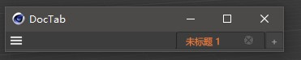

# C4D_DocTab

## Introduction

Document tag plugin for C4D R20 and above.

The current version can only be right-aligned, and future versions may be updated.

## version

**v1.0** basic functions.

**v1.1** fixes interface dislocation, optimizes opening documents and checking active documents.

**v1.2** Add the function of opening recent documents(R20 API does not support, no update)

**v1.3** Fix the problem that the switching interface is not displayed, and the problem that the document name is not displayed completely.

## Author

aimidi

## GitHub

https://github.com/AiMiDi/C4D_DocTab

------

## 简介

C4D R20以上版本用的文档标签插件。

目前版本只能右对齐，以后版本可能会更新。

## 版本

**v1.0** 基本功能.

**v1.1** 修复界面错位，优化打开文档和检查活动文档.

**v1.2** 添加打开最近文档功能（R20 API不支持，没有更新）。

**v1.3** 修复切换界面不显示的问题，修复文档名称显示不全问题。

## 作者

aimidi

## GitHub

https://github.com/AiMiDi/C4D_DocTab